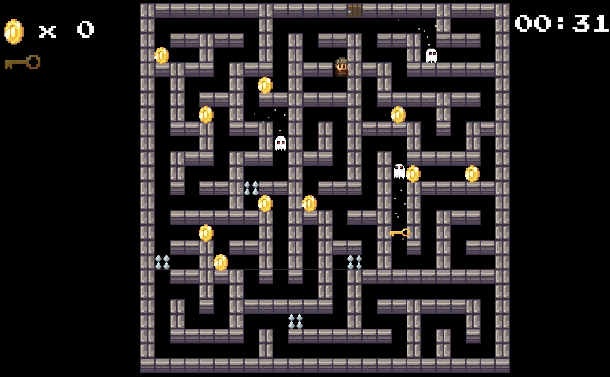

  
  
  
  

  <b>🎮 Play the game here:</b> 
  <a href="https://jkxzvb.itch.io/dungeon-break">https://jkxzvb.itch.io/dungeon-break</a>

  

---

## 🏰 Dungeon Break

**Dungeon Break** is a top-down arcade dungeon crawler set inside a procedurally generated labyrinth.

You are dropped into a shifting maze filled with danger, loot, and one clear objective: **escape alive**.

---

## 🎮 Gameplay

- 🧭 Explore a **procedurally generated labyrinth dungeon**
- 💰 Collect coins scattered across the map to increase your score
- ⏱️ Survive while the timer tracks your run performance
- 🔑 Find the **key**, then unlock the **exit door**
- 👻 Avoid roaming ghosts that actively hunt you down
- ⚠️ Dodge spike traps that activate unpredictably
- 🧠 Plan routes carefully to avoid getting cornered

The gameplay focuses on **navigation, survival, and route planning**, where every decision matters as the dungeon shifts around you.

---

## 🎨 Visual Style

- Top-down perspective
- Pixel art aesthetic
- Carefully designed color palette optimized for **OLED screens**
- Each run feels unique due to procedural generation

---

## 📸 Gameplay

  

